# Codex Tracker

Made by [Heavymask](https://heavymask.com).

Codex Tracker is a lightweight Windows, macOS, and Linux desktop overlay for monitoring live
Codex allowance windows, reset times, token activity, and account credits. It
connects to the installed Codex CLI through its supported `app-server` JSON-RPC
interface and keeps authentication in Codex rather than reading local
authentication files.

## At a glance

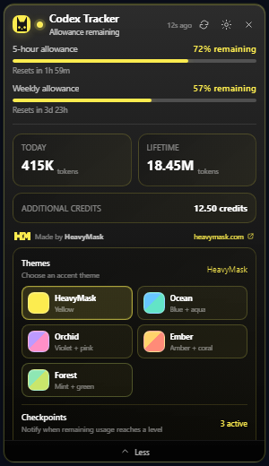

The compact overlay stays above normal windows and can be dragged from its
header. It is designed to make the most important account information visible
without requiring a full dashboard or a browser tab.

## Features and functionality

| Feature | What it does | Why it matters |
| --- | --- | --- |
| Live allowance tracking | Displays every allowance window returned for the main Codex quota bucket. | Shows the current account state without guessing an absolute token capacity. |
| Remaining percentages | Presents used and remaining percentages with clear visual progress bars. | Makes quota consumption easy to scan at a glance. |
| Reset countdowns | Shows the time remaining until each allowance window resets. | Helps plan work around the next available quota window. |
| Token activity | Expanded mode shows today’s tokens, lifetime tokens, and peak daily tokens. | Provides useful activity context alongside allowance percentages. |
| Credits and spend controls | Displays additional credits, unlimited status, balance, and spend-control information when supplied by Codex. | Keeps paid usage information in the same monitoring surface. |
| Codex discovery | Searches supported install locations and PATH, or lets the user choose the Codex executable directly. | Works with common Windows, macOS, and Linux installations while retaining a manual fallback. |
| Browser sign-in | Opens Codex authentication in the system browser when sign-in is required. | Keeps credential handling inside the official Codex flow. |
| Reconnection handling | Supervises the private Codex app-server process and retains the last snapshot as stale while reconnecting. | Avoids turning a temporary connection problem into an empty dashboard. |
| Refresh controls | Supports manual refresh plus a configurable automatic refresh interval. | Lets users balance freshness and background activity. |
| Usage checkpoints | Accepts configurable percentage thresholds and notifies the user when remaining usage crosses them downward. | Provides an early warning before a quota window is exhausted. |
| Themes and palettes | Includes dark/light modes and HeavyMask, Ocean, Orchid, Ember, and Forest palettes. | Supports different environments while preserving readable contrast. |
| Tray behavior | Closing the overlay hides it to the system tray; tray actions can show or quit the app. | Keeps the tracker available without occupying taskbar or dock space. |
| Start at login | Enables autostart by default and exposes a setting to disable it. | Makes monitoring available after login without manual relaunching. |
| Native desktop packaging | Builds a Windows NSIS installer, universal macOS DMG, Linux AppImage, and Debian package with HeavyMask branding. | Provides native distributable applications rather than only a development build. |

## Demonstrations

### Dark-mode monitoring


This capture demonstrates the main monitoring view with:

- a five-hour allowance at 72% remaining;
- a weekly allowance at 57% remaining;
- reset countdowns for both windows;
- today and lifetime token totals;
- additional credits;
- active HeavyMask branding;
- theme palette choices; and
- three active usage checkpoints.

#### Dark-mode palette gallery

In dark mode, the selected palette drives the progress gradients, remaining
percentage emphasis, controls, borders, and other accent details while the
dark glass surface keeps the overlay low-glare.

<table>
  <tr>
    <td>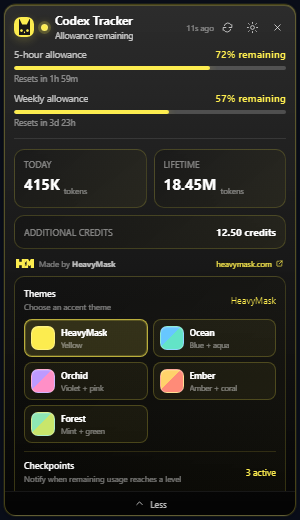</td>
    <td>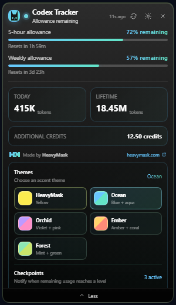</td>
    <td>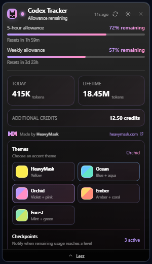</td>
    <td>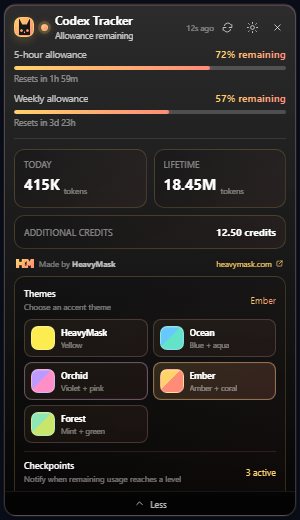</td>
    <td>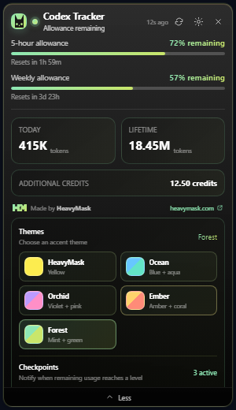</td>
  </tr>
  <tr>
    <td align="center"><strong>HeavyMask</strong><br>Yellow + mint</td>
    <td align="center"><strong>Ocean</strong><br>Blue + aqua</td>
    <td align="center"><strong>Orchid</strong><br>Violet + pink</td>
    <td align="center"><strong>Ember</strong><br>Amber + coral</td>
    <td align="center"><strong>Forest</strong><br>Mint + green</td>
  </tr>
</table>

### Light-mode monitoring

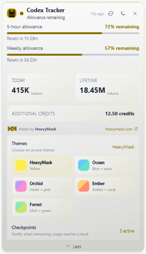

The same information remains readable on a light host background. The palette
and controls adapt while the quota data, reset times, token totals, credits,
and checkpoint status remain consistent.

#### Light-mode palette gallery

Light mode uses the same five palettes with lighter surfaces and adjusted text
contrast. This makes the accent choice visible without sacrificing readability
on bright desktop backgrounds.

<table>
  <tr>
    <td>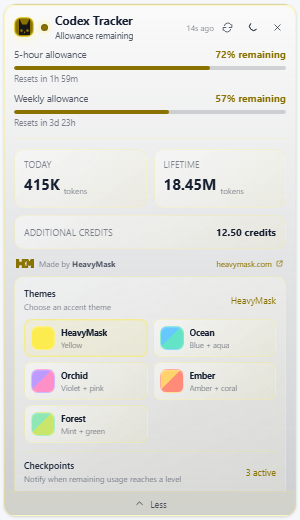</td>
    <td>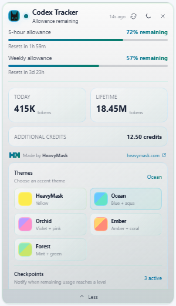</td>
    <td>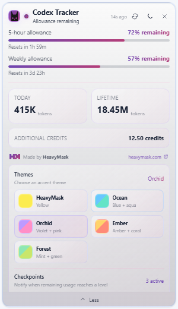</td>
    <td>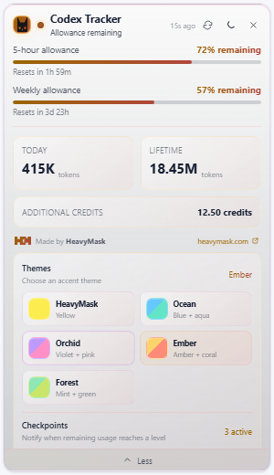</td>
    <td>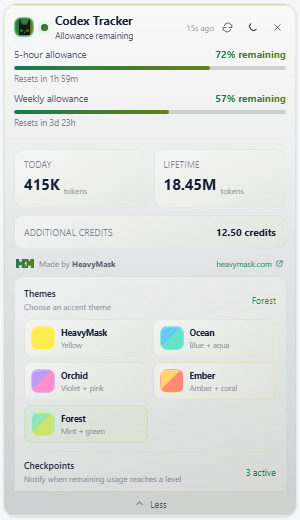</td>
  </tr>
  <tr>
    <td align="center"><strong>HeavyMask</strong><br>Yellow + mint</td>
    <td align="center"><strong>Ocean</strong><br>Blue + aqua</td>
    <td align="center"><strong>Orchid</strong><br>Violet + pink</td>
    <td align="center"><strong>Ember</strong><br>Amber + coral</td>
    <td align="center"><strong>Forest</strong><br>Mint + green</td>
  </tr>
</table>

All palettes are selectable from the expanded **Themes** panel. The choice is
stored locally, so the preferred palette is restored the next time the overlay
opens.

### Typical user flow

```text
Launch Codex Tracker
        |
        v
Find the Codex executable and start Codex app-server
        |
        +--> Codex needs authentication? --> Open browser sign-in
        |
        v
Read allowance, usage, and credit snapshots
        |
        v
Render compact overlay and refresh on schedule
        |
        +--> Threshold crossed? --> Show in-app and desktop notification
        |
        +--> Connection interrupted? --> Keep stale snapshot and reconnect
```

## How to build

### Install prerequisites

```powershell
npm.cmd install
npm.cmd run tauri dev
```

All release builds require Node.js 22 and the stable Rust toolchain. Windows
also requires the Visual C++ build tools and WebView2. macOS requires Xcode
Command Line Tools plus both Apple Rust targets:

```bash
rustup target add aarch64-apple-darwin x86_64-apple-darwin
```

Linux requires Tauri's WebKit and tray build dependencies. On Ubuntu 22.04:

```bash
sudo apt-get update
sudo apt-get install -y libwebkit2gtk-4.1-dev libappindicator3-dev librsvg2-dev patchelf
```

### Build native releases

Each command runs the frontend tests, performs a release-mode Tauri build, and
copies the finished installer bundles into `artifacts/`.

```powershell
# Windows
npm.cmd run build:exe
```

```bash
# macOS: universal Apple Silicon + Intel DMG
npm run build:macos

# Linux x64: AppImage + Debian package
npm run build:linux
```

The macOS and Linux commands must run on their native operating system. Tauri
does not create those desktop bundles from Windows. The current packages are
not signed with a platform developer identity or notarized.

The GitHub macOS release requires an Apple Developer ID Application certificate
and notarization credentials. Add these repository secrets before rerunning the
macOS workflow: `APPLE_CERTIFICATE` (base64 `.p12`),
`APPLE_CERTIFICATE_PASSWORD`, `APPLE_SIGNING_IDENTITY`, `KEYCHAIN_PASSWORD`,
`APPLE_ID`, `APPLE_PASSWORD` (an app-specific password), and `APPLE_TEAM_ID`.
The workflow refuses to publish an ad-hoc-only DMG.

For the existing DMG, verify its published SHA-256 checksum first. Then open
the app once, go to **System Settings > Privacy & Security**, and choose
**Open Anyway**. macOS makes that exception available for about an hour after
the blocked launch. You can also Control-click the app in Finder and choose
**Open**. A signed and notarized DMG should be published after the secrets are
configured.

### Publish macOS and Linux bundles

The `Release macOS and Linux` GitHub Actions workflow builds on native runners,
records SHA-256 checksums, and uploads the DMG, AppImage, and Debian package to
the existing `heavymask` release. It can also be run manually with a different
existing release tag. If a repository has locked that release as immutable, the
workflow creates a companion `heavymask-macos-linux` release instead.

## Project architecture

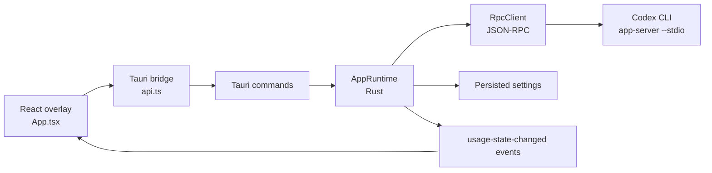

The frontend is responsible for presentation, interaction, formatting, and
theme state. The Rust backend owns native window/tray behavior, process
supervision, settings persistence, Codex communication, notifications, and
the typed state sent back to React.

## Safety and data handling

- Codex authentication remains managed by Codex and the system browser.
- The app communicates with the Codex CLI through `codex app-server --stdio`.
- Large token values are preserved as decimal strings/`BigInt`-compatible data
  instead of being forced through JavaScript `Number` precision.
- If a connection drops, the last in-memory snapshot is marked stale while
  the runtime attempts to reconnect.

## Verification

The project includes frontend unit tests, a TypeScript/Vite build, Rust checks,
live Codex response-shape smoke testing, and Playwright visual coverage:

```powershell
npm.cmd test
npm.cmd run build
cargo check --manifest-path src-tauri\Cargo.toml
npm.cmd run test:playwright -- --workers=1
```

## License

Codex Tracker is licensed under the [Apache License, Version 2.0](LICENSE).
HeavyMask names, logos, and other brand assets remain subject to the notices
in [NOTICE](NOTICE).

Made by [Heavymask](https://heavymask.com).
